# Walchensee Wonder
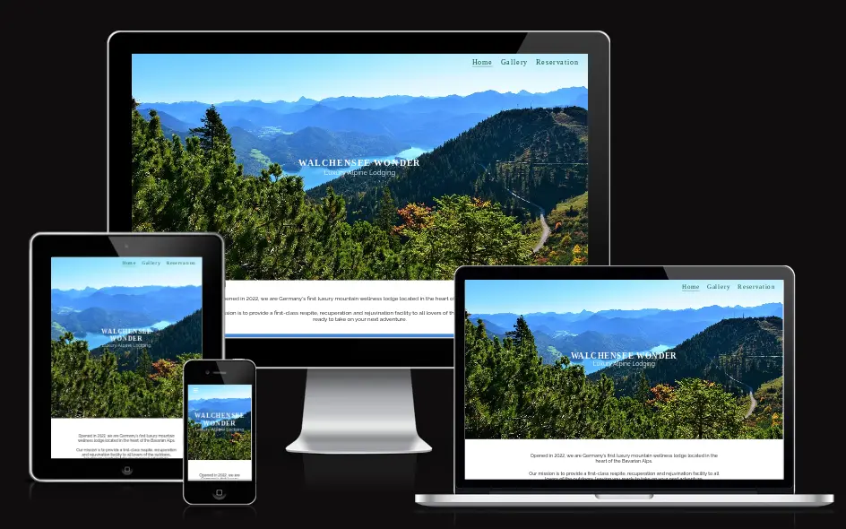

## Purpose

Walchensee Wonder is a website for a fictitious mountain lodge nestled in the Bavarian Alps, with a focus on wellbeing and mindfulness. 

The site will be aimed at hikers, travellers and anyone looking for a space to recuperate and disconnect from the business of daily life, in a peaceful and stunning mountain environment.

The main purposes of the site are:
- to advertise the mountain wellness lodge to a wide audience
- to provide any potential guests with the details of our packages and what they each include
- to offer the user a clear and easy navigation experience, so that they can find the content they are looking for
- to convince the user of the benefits of each wellness activity and facility that the lodge provides 
- to provide the user with the ability to arrange a reservation

[View the live deployed website here.](https://aoifemcoleman.github.io/Wellness-Walchensee/index.html)

## Features

### Existing Features

- __Navigation Bar__

The website features a responsive navbar, which appears as a burger icon on devices with a viewport width of less than 768px, and on desktops appears as part of the hero image, to ensure the hero image, with a beautiful view of the location, commands the users focus on screens.

The links in the navigation bar appear in bold when hovered over on larger screens, and bolden when clicked on smaller screens. The current page a user is on is also underlined on all screens.

- _Desktop view:_

- _Mobile view (when burger icon is clicked):_

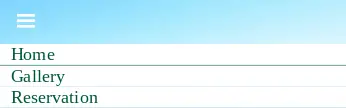

- __Hero Image__

The hero image is the view that will be available to potential guests of the mountain lodge, and is used to capture the user's interest. It includes text overlay with the website title (the name of the mountain lodge) within a h1 element, as well as a brief description of "Luxury Alpine Lodging" to make it clear to any visitors of the site what the product is.

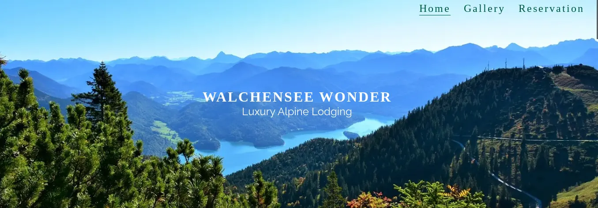

- __About Us Section__

Under the header is an "About" section, where the user is provided with some details regarding the opening of the mountain lodge, and the aims for their experience when staying in it. 

It was decided not to add a header element here, as this made the section appear cluttered among multiple eye-catching headers, and it can already be assumed from the short content what it is in relation to.

- __Offers Section__

    - In this section, the user can see what is included during a stay in the lodge, and informed of the health benefits behind each activity offered.
    - Images of each offer are included so that a user has a visual idea of what to expect during their stay.
    - A colour palette from [Coolers](https://coolors.co/) was used here in order to complement the image of Walchensee in the hero section, and the use of contrasting colours from light to darker shades has the intention of making each section clearly separate.

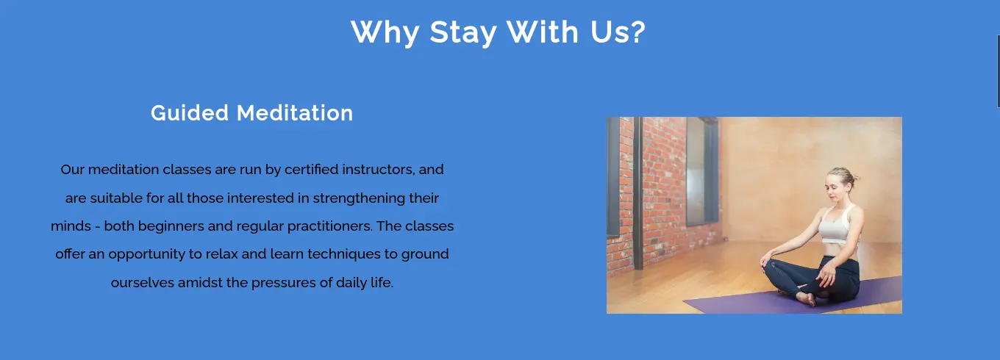

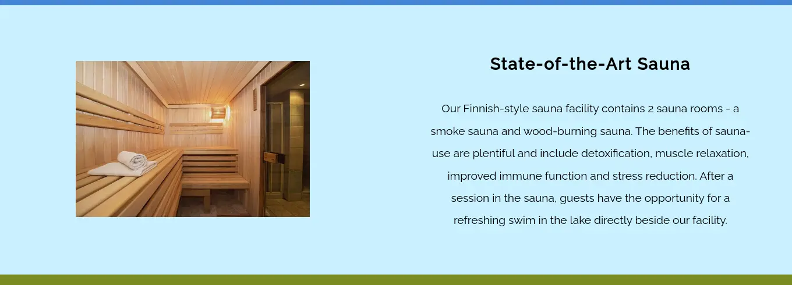

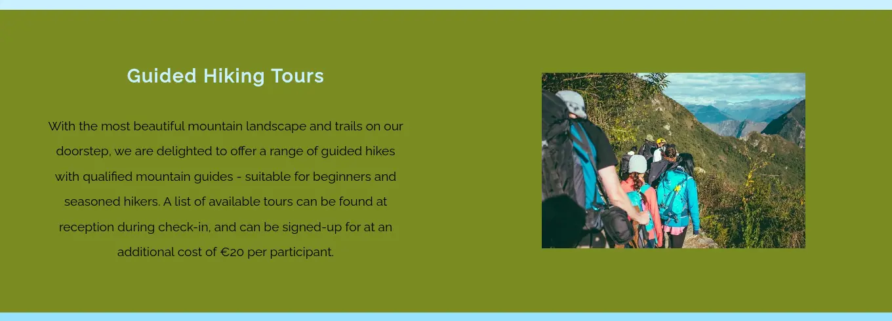

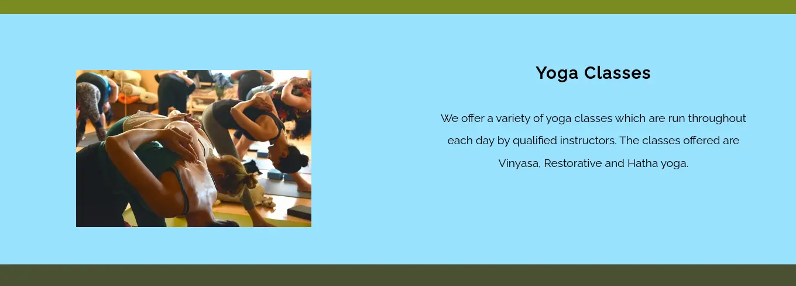

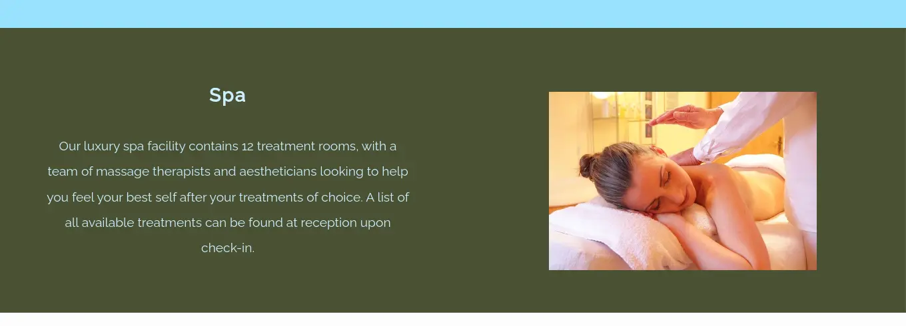

- __Location Section__

The website contains an iframe of the Google Maps link to the mountain lodge's fictional address. 

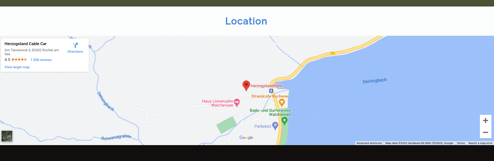 

Visitors to the website can interact with this map within the website, by zooming in and out to see the exact location and its surroundings.

- __Footer__

Within the footer, users have quick and easy access to all forms of contact. They have the option to contact the lodge via phone, email (with a mailto link that will open their email app directly), via the address, or by connecting with the lodge on various forms of social media. They can also click on the `Make a Reservation Request` link to be brought to the reservation form.

The social media icons will open a new tab when clicked to the associated social media network landing page.

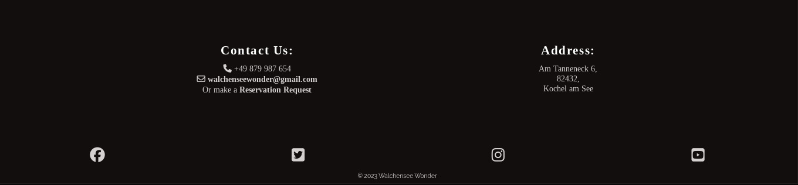

- __Gallery__

The gallery is contained within a new page, and comprises an attention-grabbing header and 8 images conveying all of the experience a guest can have at Walchensee Wonder. The aim of the gallery is to portray the beauty of the location, the assortment of luxury peaceful activties they can partake in, and to entice the user to book a stay in the lodge.

- Desktop view

    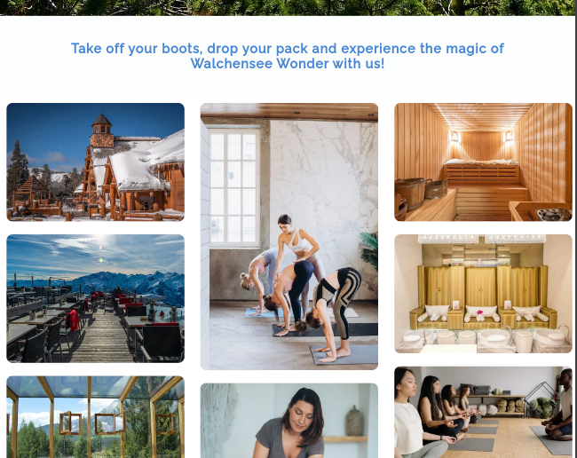

- Mobile view

    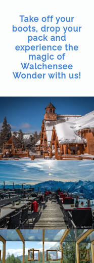

- __Reservation Form__

The reservation form is within the final page of the website. In this section users of the website can view the various package options available to them, and make a request to book for their chosen date.

There are also links to the reservation request form within the contact section of the footer on both the Home and Gallery pages.

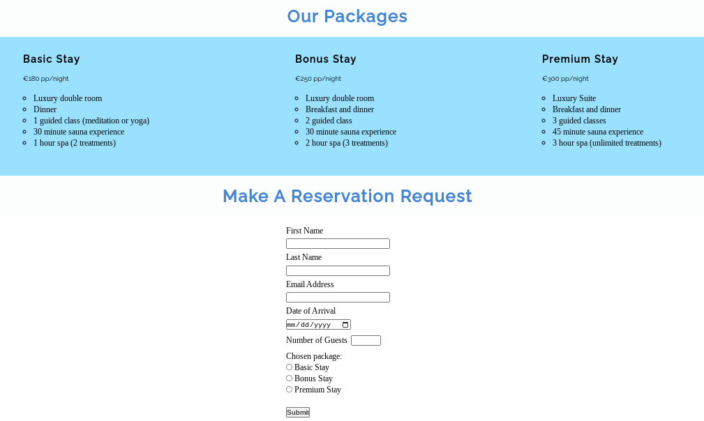

### Features left to implement

- Realtime reservation form, where guests can select a package and room of their choice on their selected date based on the availability communicated from the back-end.

## Testing

The website has been tested on multiple devices and browsers. It has been manually tested on Google Chrome, Firefox and Safari desktops, as well as Android and macOS. Within Chrome developer tools, the website has been tested on multiple different devices of various viewport widths and heights, and is fully responsive.

### Clickable links:

- __Navigation Bar__

    The navbar was tested on all screen sizes to ensure responsivity. On screens above 768px, the navbar appears horizontally across the hero image, and links bolden when hovered over and clicked. 

    On smaller screens, the navbar collapses into a 'burger icon', with the menu items displaying in a white column under it.

- __Footer__
    
    The footer contains a mailto link effect that directs a user to their default email client when clicked. This was tested on desktop and mobile devices. On desktop devices, the user is directed to their default email client's website, and on mobile devices, the user is directed to their email application.

    The footer also contains a link to the reservation form, and this opened the reservation.html page on all tested devices.

    The social media icons when clicked open the landing page within a new browser window, or when the relevant application is installed, they are directed to the application.

- __Gallery__

    The gallery was tested to ensure the alt text displayed whenever a link was broken. This was also tested with the images on the Home page.

- __Reservation Form__

    The reservation form features types within its inputs that ensure the user is entering the correctly corresponding data into the form. This was tested by entering an email address without the @ symbol - which the form refused to accept. 

    The user is required to insert a number of guests between 1 minimum and 5 maximum guests. If a user enters a number above or below these numbers, they will see a pop-up asking them to re-enter the data correctly.
    
    The user is also required to fill out each field, or the form will not submit. 

 - Accessibility

The website was also tested for Accessibility, as it incorporates alt text, aria-labels and contrasting colours for screen reader use, and received a score of 100% using Lighthouse in Chrome Developer Tools.

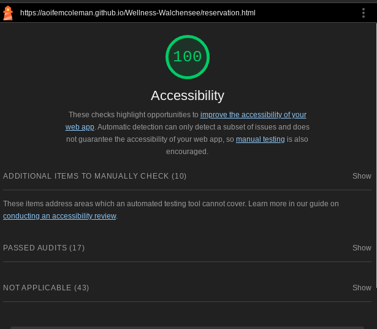

### Validator testing

HTML:

Some issues were returned when passed through the official [W3C validator](https://validator.w3.org/).

- index.html
    
    The html had some stray div elements, which have since been removed. 

    There was a duplicate id of #map for both the map section and the iframe. The ID was removed from the iframe, and replaced with a #iframe id to which a width attribute was added, and then extra padding added to the footer element to prevent any overlapping.

    There was a missing semi-colon after the checkbox code, which has since been added.

    The html returned no errors when it was passed through again.

    - gallery.html

    The gallery returned one error which was the semi-colon missing after the checkbox code, which has since been added to all pages.

    - reservation.html

    The html on this page returned one error which was the label for the radio buttons, as the for attribute must have a non-hidden form control. To rectify this, a h4 heading was used to display the heading.

CSS:

One issue was returned when passed through the official [Jigsaw validator](https://jigsaw.w3.org/css-validator/validator). 

This was a background colour of 'none' which had been added to the nav rule in the media query for screens with a min. width of 768px. This has since been deleted, and as a rule already existed to make the background colour transparent, no further action was needed. No errors were returned when passed through again.

### Unfixed bugs

Changing the default preview image when website is shared via social media:

The default preview icon is currently image woman-3053492_640.webp. Whilst this image is also reflective of the concept of Walchensee Wonder, the hero image of Walchensee would be more enticing for a lover of the outdoors - whom the target audience for this product is.

I have changed the meta tags as suggested [here](https://stackoverflow.com/questions/19632323/default-website-image-for-social-sharing) but the image remains as either the same on Instagram, or unavailable on Whatsapp and Facebook. However, as this is not a necessary change I decided to leave the image as it is.

## Deployment

The site was deployed to GitHub using the following steps:

1. From the repository page, click on `Settings` in the navbar.
2. On the left side of the page, in the `Code and Automation` section, select `Pages`.
3. Under `Build and development`, the source should be set to `Deploy from a branch`.
4. Under `Branch` select `Main`, then `/root` and press `Save`.
5. Navigate back to the `<>Code` page in the navbar.
6. On the right side of the page, under `Deployments` you will see a link to `github-pages`, within which you can click on the expand icon to view the deployed website.

## Credits

### Content

The idea behind the context of this website was taken from my own love of hiking, wellness and the outdoors, and my experience living near the German Alps.

However, I did use content from a variety of websites when researching some of the wellness activities:

- In researching saunas, I used ideas from these websites [here](https://www.loylyhelsinki.fi/en/public-sauna) and [here](https://www.fluidra.com/projects/finnish-saunas/) when writing my content.
- I also took inspiration from the [website](https://meditation-in-muenchen.de/ap-wed/) of a meditation class I attended myself in Munich.

I also used the site [Coolors](https://coolors.co/) to make a colour palette that would compliment the hero image and style of the website. 

I imported my fonts from [Google Fonts](https://fonts.google.com/).

### Media

- The favicon is by John Sorrentino and was taken from [favicon.io](https://favicon.io/emoji-favicons/national-park/).
- walchensee-4518931_1280.webp was by RitaE and was taken from [pixabay](https://pixabay.com/photos/walchensee-lake-herzogstand-mountain-4518931/).
- adventure-1839147_640.webp is by Pexels and taken from [pixabay](https://pixabay.com/photos/adventure-clouds-exploration-group-1839147/).
- alps-4766516_640.webp is by Ri_Ya and taken from [pixabay](https://pixabay.com/photos/alps-restaurant-mountain-idyllic-4766516/).
- pexels-chris-f-11616145.webp is by Chris F and taken from [Pexels](https://www.pexels.com/photo/the-sunspot-mountaintop-lodge-in-winter-park-11616145/).
- pexels-elina-fairytale-3865792.webp is by Elina Fairytale, and taken from [Pexels](https://www.pexels.com/photo/women-doing-yoga-3822668/).
- pexels-elina-fairytale-3865792.webp is by Elina Fairytale, and taken from [Pexels](https://www.pexels.com/photo/woman-lying-on-bed-while-having-a-massage-3865792/).
- pexels-max-rahubovskiy-8092430.webp is by Max Rahubovskiy and taken from [Pexels](https://www.pexels.com/photo/interior-of-sauna-8092430/).

- window-3178666_640.webp is by mosiunterwegs and taken from [pixabay](https://pixabay.com/photos/window-house-inside-wood-luxury-3178666/).

- pexels-pixabay-161737.webp is by Pixabay and taken from [Pexels](https://www.pexels.com/photo/brown-chair-with-white-pillows-161737/).

- pexels-thalia-kensinger-19216438.webp is by Thalia Kensinger and taken from [Pexels](https://www.pexels.com/@thalia-kensinger-794879652/featured-uploads/).

- pexels-yan-krukau-8436490.webp is by Yan Krukau and taken from [Pexels](https://www.pexels.com/a-man-instructing-yoga-to-a-group-of-women-8436490/).
- pool-3001209_640.webp is by nkaminetskyy and taken from [pixabay](https://pixabay.com/de/photos/schwimmbad-sauna-bad-urlaub-3001209/).
- wellness-285587_640.webp is by rhythmuswege and taken from [pixabay](https://pixabay.com/photos/wellness-massage-relax-relaxing-285587/).
- woman-3053492_640.webp is by lograstudio and taken from [pixabay](https://pixabay.com/photos/woman-yoga-meditation-mindfulness-3053492/).
- yoga-1994667_640.webp is by shushipu and taken from [pixabay](https://pixabay.com/photos/yoga-yoga-class-fitness-exercise-1994667/).

### Code

- Code for the hero image and text was taken, and modified for my website, from [W3 Schools](https://www.w3schools.com/howto/howto_css_hero_image.asp).
- Code snippets and understanding of how to create a hamburger menu for the responsive nav bar were taken from both the Code Institute Love Running project, and from [here](https://www.youtube.com/watch?v=4996fn82c4c), and modified.
- Understanding of the var() function, inline and block elements and general responsivity was gained through this [video](https://www.youtube.com/watch?v=bn-DQCifeQQ&t=1557s).
- Knowledge of creating mailto links was gained from [W3 Docs](https://www.w3docs.com/snippets/html/how-to-create-mailto-links.html).
- Understanding of line-height was gained through [mdn web docs](https://developer.mozilla.org/en-US/docs/Web/CSS/line-height).
- Code snippets for the responsive gallery were taken from Code Institute's [Love Running](https://github.com/Code-Institute-Solutions/love-running-v3/blob/main/6.1-lets-add-some-images/assets/css/style.css) project, and modified.
- Code taken from Code Institute's [Love Running](https://github.com/Code-Institute-Solutions/love-running-v3/blob/main/5.3-meetup-times/index.html) project for social media icon section.
- Inspiration and some code for the iframe was taken from the [Coder's Coffehouse](https://learn.codeinstitute.net/courses/course-v1:CodeInstitute+LRR101+2021_T1/courseware/9645be8635124d76b35692f1f1f6b753/2c4f82a9ef174830aa83ff2cf10f4bc7/) project and adapted.

## Acknowledgements

I would like to thank my mentor Ronan McClelland for all of his support, guidance, patience and enthusiasm for my project. 

I would also like to thank the Code Institute tutoring team for their guidance and support during my moments of panic, and the Slack community who took time out of their own project work to help me with mine.