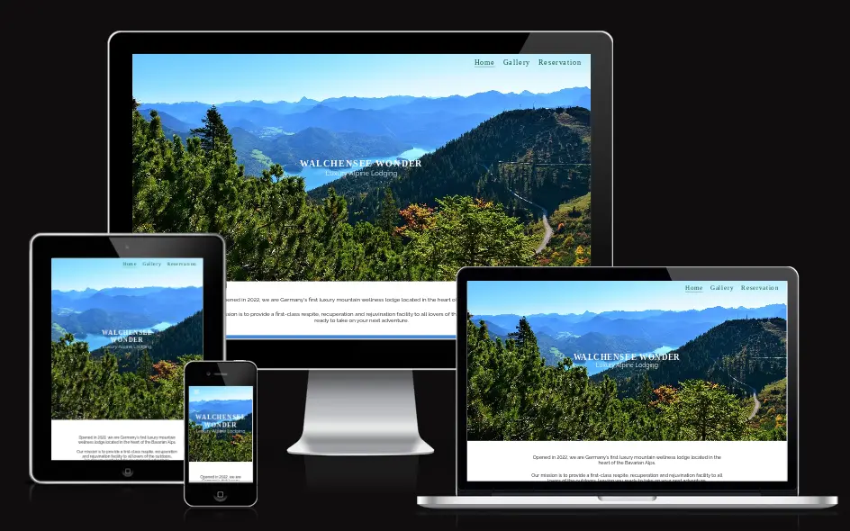
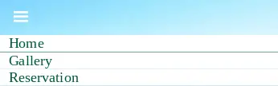
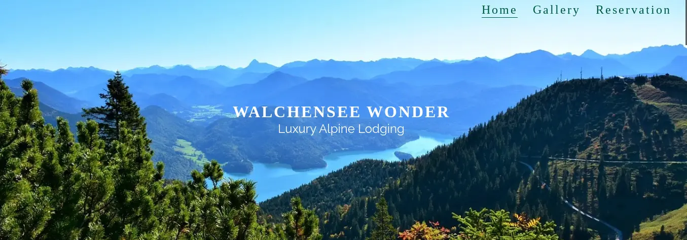

# Walchensee Wonder

## Purpose

Walchensee Wonder is a site for a fictitious mountain lodge nestled in the Bavarian Alps, with a focus on wellbeing and mindfulness. The site will be aimed at hikers, travelers and anyone looking for a space to recuperate and disconnect from the business of daily life, in a peaceful and stunning mountain environment.

The main purposes of the site are to advertise the mountain wellness lodge to a wide audience, to provide any potential guests with the details of our packages and what they each include, to convince the user of the benefits of each wellness activity and facility that the lodge provides, and to provide the user with the ability to arrange a reservation.

[View the live deployed website here.](https://aoifemcoleman.github.io/Wellness-Walchensee/index.html)

## Features

### Existing Features

- __Navigation Bar__

The website features a responsive navbar, which appears as a burger icon on devices with a viewport width of less than 768px, and on desktops appears as part of the hero image, to ensure the hero image, with a beautiful view of the location, commands the users focus on screens.

The links in the navigation bar appear in bold when hovered over on larger screens, and bolden when clicked on smaller screens. The current page a user is on is also underlined on all screens.

- _Desktop view:_

- _Mobile view (when burger icon is clicked):_

- __Hero Image__

The hero image is the view that will be available to potential guests of the mountain lodge, and is used to capture the user's interest. It includes text overlay with the website title (the name of the mountain lodge) within a h1 element, as well as a brief description of "Luxury Alpine Lodging" to make it clear to any visitors of the site what the product is.

- __About Us Section__

Under the header is an "About" section, where the user is provided with some details regarding the opening of the mountain lodge, and the aims for their experience when staying in it. 

It was decided not to add a header element here, as this made the section appear cluttered among multiple eye-catching headers, and it can already be assumed from the short content what it is in relation to.

- __Offers Section__

    - In this section, the user can see what is included during a stay in the lodge, and informed of the health benefits behind each activity offered.
    - Images of each offer are included so that a user has a visual idea of what to expect during their stay.
    - A colour palette from [Coolers](https://coolors.co/) was used here in order to complement the image of Walchensee in the hero section, and the use of contrasting colours from light to darker shades has the intention of making each section clearly separate.

- __Location Section__
- __Gallery__
- __Reservation Form__

### Features left to implement

## Testing

### Validator testing

HTML 

### Unfixed bugs

- Preview image when site shared via social media

## Deployment

## Credits

### Contents

### Media

### Code

## Acknowledgements

